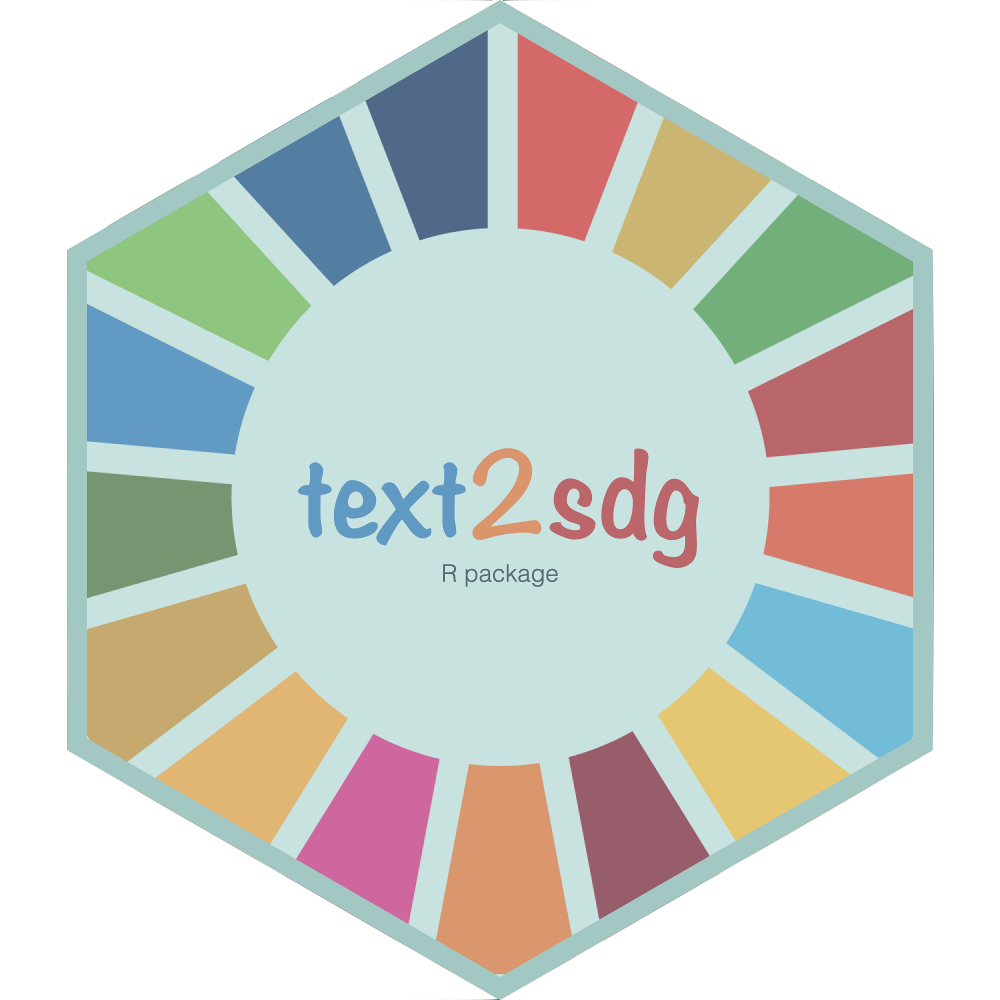
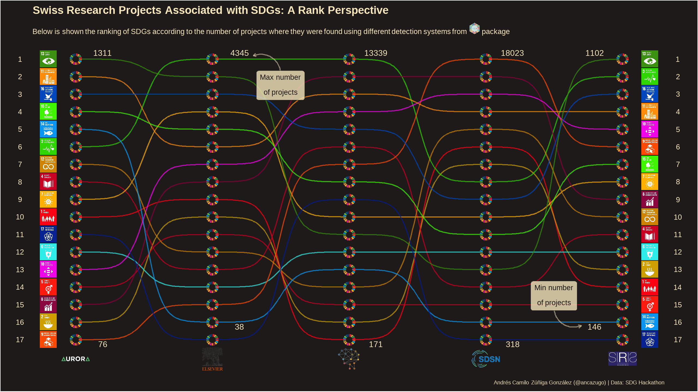

2021 SDG Hackathon
================
Andrés Camilo Zúñiga González
11/5/2021

This is the code of my submission for the [2021 SDG
Hackathon](https://www.sdghackathon.io/) organized by CORRELAID and the
University of Basel, which took place in November 5th and 6th virtually.

Original Repository with the data used for the visualization can be
found [here](https://github.com/CorrelAidSwitzerland/sdghackathon).

## Packages

``` r
library(tidyverse)
library(glue)
library(patchwork)
library(ggbump)
library(ggtext)
library(ggimage)
library(emojifont)
library(RColorBrewer)
```

## Data Wrangling

Reading and filtering the source data.

``` r
df <- read_csv('sdg_hackathon_data.csv') %>% 
    mutate(approved_amount = case_when(approved_amount == 'data not included in P3' ~ NA_real_,
                                       T ~ as.numeric(approved_amount))) %>% 
    filter(!is.na(hits)) %>% 
    arrange(system, sdg, hits)

supp <- read_csv('supplementary_data.csv') %>% 
    left_join(df %>% 
                  select(project_number, project_title, keywords, 
                         start_date, end_date, funding_instrument,
                         approved_amount, responsible_applicant, university,
                         discipline_name) %>% 
                  distinct(),
              by = 'project_number')
```

Linking Icon files (SDGs and System types) with their names and colours
for HTML rendering.

``` r
sdg_values <- df %>% pull(sdg) %>% sort() %>% unique()
sdg_icons_files <- list.files('SDG Icons 2019/', pattern = '*.jpg', full.names = T) 

sdg_labels <- glue("")
# sdg_labels <- paste0("")
names(sdg_labels) <- sdg_values

system_values <- df %>% pull(system) %>% sort() %>% unique()
system_icons_files <- list.files('system_icons/', pattern = '*.png', full.names = T)

system_sizes <- c(25, 20, 20, 25, 25)
system_labels <- glue("")
# system_labels <- paste0("")
names(system_labels) <- system_values

un_color <- '#00ADEF'
sdg_colors <- c('#fc0014', '#ce9f00', '#2fd400', '#c60021', '#c60021',
                '#2eede8', '#ffb000', '#840038', '#ff4a05', '#f005e8',
                '#ff8c0a', '#cc8200', '#358c0a', '#0a96f0', '#40f500',
                '#0046bc', '#001b8b')
names(sdg_colors) <- sdg_values
```

Aggregating data for minimum and maximum values, and adding the path to
the SDG wheel icon as a column

``` r
df_summary <- df %>% 
    filter(!is.na(approved_amount)) %>% 
    select(sdg, system, approved_amount, hits) %>% 
    group_by(sdg, system, ) %>% 
    summarise(min = min(approved_amount), max = max(approved_amount),
              mean = mean(approved_amount), median = median(approved_amount),
              n_projects = sum(!is.na(hits)), mean_hits = mean(hits)) %>% 
    ungroup() %>% 
    mutate(wheel_path = 'SDG-Wheel_WEB.png', 
           system_path = case_when(system == 'aurora' ~ 'system_icons/aurora.jpg',
                                   system == 'elsevier' ~ 'system_icons/elsevier.jpg',
                                   system == 'ontology' ~ 'system_icons/ontology.png',
                                   system == 'sdsn' ~ 'system_icons/sdsn.jpg',
                                   system == 'siris' ~ 'system_icons/siris.jpg'))
```

Creating the ranking dataframe using the aggregated data

``` r
df_rank <- df_summary %>%  
    pivot_wider(id_cols = sdg, names_from = system, values_from = n_projects) %>% 
    arrange(desc(aurora)) %>% 
    mutate(aurora_rank = 1:17, .after = aurora) %>% 
    arrange(desc(elsevier)) %>% 
    mutate(elsevier_rank = 1:17, .after = elsevier) %>% 
    arrange(desc(ontology)) %>% 
    mutate(ontology_rank = 1:17, .after = ontology) %>% 
    arrange(desc(sdsn)) %>% 
    mutate(sdsn_rank = 1:17, .after = sdsn) %>% 
    arrange(desc(siris)) %>% 
    mutate(siris_rank = 1:17, .after = siris) %>% 
    arrange(sdg) %>%
    # select(sdg, ends_with('rank')) %>% 
    pivot_longer(cols = ends_with('rank'), names_to = 'system', values_to = 'rank') %>% 
    mutate(system = factor(system, 
                           levels = c('aurora_rank', 'elsevier_rank',
                                      'ontology_rank', 'sdsn_rank', 
                                      'siris_rank'))) %>% 
    mutate(system_num = as.numeric(system),
           sdg_icon = sdg_labels[sdg],
           sdg_color = sdg_colors[sdg])
```

Creating the dataframe for the systems

``` r
# n_labels <- df_rank %>% pull(system) %>% unique()
# names(system_labels) <- 1:5

system_icon_df <- tibble(
    x = 1:5,
    y = rep(18, 5),
    icon = system_labels
)
```

Dataframes for the numbers displayed as maximum and minimum for each
system

``` r
df_rank_range <- df_rank %>% 
    filter(rank %in% c(1, 17)) %>% 
    pivot_longer(aurora:siris, names_to = 'system_name', values_to = 'projects') %>% 
    mutate(projects = case_when(is.na(projects) ~ 0L, T ~ projects)) %>% 
    arrange(rank)

df_rank_range2 <- df_rank %>% 
    filter(rank %in% c(1, 16)) %>% 
    pivot_longer(aurora:siris, names_to = 'system_name', values_to = 'projects') %>% 
    mutate(projects = case_when(is.na(projects) ~ 0L, T ~ projects)) %>% 
    arrange(rank)
```

Dataframe for textboxes used with arrows

``` r
df_textbox <- tibble(
    x = c(2.5, 4.5),
    y = c(2.5, 14.5),
    xstart = c(2.5, 4.5),
    xend = c(2.3, 4.7),
    ystart = c(1.7, 15.3),
    yend = c(0.8, 16.2),
    text = c("<span style='font-size:20pt; color:#1f1a1a'> Max number<br style='line-height:5px;'> of projects</span>",
             "<span style='font-size:20pt; color:#1f1a1a'> Min number<br style='line-height:5px;'> of projects</span>")
)
```

## Final Plot

``` r
plot <- df_rank %>% 
    ggplot(aes(x = system_num, y = rank, color = sdg)) +
    geom_bump(alpha = .7) +
    geom_point(size = 2, color = '#1f1a1a') +
    # scale_x_discrete(labels = system_labels) +
    geom_richtext(inherit.aes = F, data = df_rank %>% 
                      filter(system == 'aurora_rank'), fill = NA, label.color = NA,
                  mapping = aes(x = system_num - 0.2, y = rank, label = sdg_icon)) +
    geom_richtext(inherit.aes = F, data = df_rank_range %>% 
                      filter(system_name == 'aurora' & system_num == 1 & rank %in% c(1, 17)),
                  fill = NA, label.color = NA, size = 8, color = '#f5e6bc',
                  mapping = aes(x = system_num + .2, y = rank + c(-.3, .3), label = projects)) +
    geom_richtext(inherit.aes = F, data = df_rank_range2 %>% 
                      filter(system_name == 'elsevier' & system_num == 2 & rank %in% c(1, 16)),
                  fill = NA, label.color = NA, size = 8, color = '#f5e6bc',
                  mapping = aes(x = system_num + .2, y = rank + c(-.3, .3), label = projects)) +
    geom_richtext(inherit.aes = F, data = df_rank_range %>% 
                      filter(system_name == 'ontology' & system_num == 3 & rank %in% c(1, 17)),
                  fill = NA, label.color = NA, size = 8, color = '#f5e6bc',
                  mapping = aes(x = system_num + .2, y = rank + c(-.3, .3), label = projects)) +
    geom_richtext(inherit.aes = F, data = df_rank_range %>% 
                      filter(system_name == 'sdsn' & system_num == 4 & rank %in% c(1, 17)),
                  fill = NA, label.color = NA, size = 8, color = '#f5e6bc',
                  mapping = aes(x = system_num + .2, y = rank + c(-.3, .3), label = projects)) +
    geom_richtext(inherit.aes = F, data = df_rank_range2 %>% 
                      filter(system_name == 'siris' & system_num == 5 & rank %in% c(1, 16)),
                  fill = NA, label.color = NA, size = 8, color = '#f5e6bc',
                  mapping = aes(x = system_num - .2, y = rank + c(-.3, .3), label = projects)) +
    geom_richtext(inherit.aes = F, data = df_rank %>% 
                      filter(system == 'siris_rank'), fill = NA, label.color = NA,
                  mapping = aes(x = system_num + 0.2, y = rank, label = sdg_icon)) +
    geom_richtext(inherit.aes = F, data = system_icon_df, fill = NA, label.color = NA,
                  mapping = aes(x = x, y = y + .1, label = icon)) +
    geom_curve(data = df_textbox, aes(x = xstart, y = ystart, xend = xend, yend = yend),
               color = '#f5e6bc', alpha = .5, arrow = arrow(length = unit(0.01, "npc"))) +
    geom_richtext(inherit.aes = F, data = df_textbox, mapping = aes(x = x, y = y, label = text),
                  fill = '#f5e6bc', color = '#1f1a1a', alpha = .8) +
    geom_image(image = 'SDG-Wheel_WEB.png', inherit.aes = F,
               mapping = aes(x = system_num, y = rank), size = .02, asp = 1.78) +
    scale_color_manual(values = sdg_colors) +
    scale_x_continuous(expand = c(.025, .025)) +
    scale_y_reverse(breaks = seq(1, 17, 1),
                    sec.axis = sec_axis(trans = ~.*1, name = NULL,
                                        breaks = seq(1, 17, 1))) + 
    labs(title = 'Swiss Research Projects Associated with SDGs: A Rank Perspective',
         subtitle = "Below is shown the ranking of SDGs according to the number of projects where they were found using different detection systems from  package",
         x = NULL,
         y = NULL,
         caption = 'Andrés Camilo Zúñiga González (@ancazugo) | Data: SDG Hackathon') +
    theme(
        panel.background = element_rect(fill = '#1f1a1a'),
        plot.background = element_rect(fill = '#1f1a1a'),
        panel.grid = element_blank(),
        axis.ticks = element_blank(),
        axis.text.x = element_blank(),
        axis.text.y = element_text(color = '#f5e6bc', size = 20, hjust = 0.5),
        axis.text.y.right = element_text(color = '#f5e6bc', size = 20, hjust = 0.5),
        plot.margin = unit(c(.1, .5, .1, .5), "cm"),
        plot.title = element_textbox_simple(face = 'bold', color = '#f5e6bc',
                                            size = 30, halign = 0, hjust = 0.5,
                                            margin = unit(c(.1, .1, .1, .1), "cm")),
        plot.subtitle = element_textbox_simple(color = '#f5e6bc',
                                            size = 20, halign = 0, hjust = 0.5,
                                            margin = unit(c(.1, .1, .1, .1), "cm")),
        plot.caption = element_textbox_simple(color = '#f5e6bc',
                                            size = 15, halign = 1, hjust = 0.5,
                                            margin = unit(c(.1, .1, .1, .1), "cm")),
        legend.position = 'none')
    
ggsave('sdg_viz.png', plot, dpi = 300, width = 2560, height = 1440, units = 'px')
```


